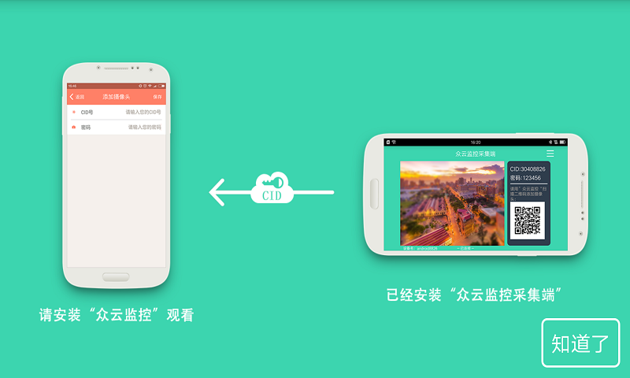

众云监控采集端
===

####本开源代码原型是市场上的公开应用“众云监控采集端”，####
####这是"掌上看家采集端"同公司人马倾情打造的，代码开源。####
####开发者们可以免费获取源代码，根据自己的需求，DIY自己想要的监控APP，####
####想要获取更多功能、更多体验请到官网注册：dev.ichano.com(注册就送100个CID)。####

开发者
------------
* 南京云恩通讯科技有限公司 - <developer@ichano.com>

需要配合使用的项目
-----
* [Viewer] [3] 此项目为众云监控采集端

本项目使用的库
------------------------------
* [zxing] [1]
* [android-support-v7-appcompat] [2]

编译需求
------------------------------
* Android 6.0

运行需求
------------------------------
* Android 2.3

应用截图
-----------

开源协议
-------

  Copyright (C) 2015 iChano incorporation's Open Source Project
 
  Licensed under the Apache License, Version 2.0 (the "License");
  you may not use this file except in compliance with the License.
  You may obtain a copy of the License at
 
       http://www.apache.org/licenses/LICENSE-2.0
 
  Unless required by applicable law or agreed to in writing, software
  distributed under the License is distributed on an "AS IS" BASIS,
  WITHOUT WARRANTIES OR CONDITIONS OF ANY KIND, either express or implied.
  See the License for the specific language governing permissions and
  limitations under the License.

[1]: https://github.com/zxing/zxing/
[2]: https://github.com/OpenIchano/android-support-v7-appcompat
[3]: https://github.com/OpenIchano/Viewer

